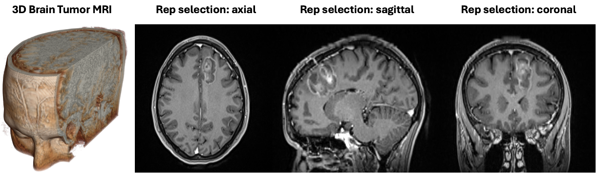

# Enhancing vision-language models for medical imaging: bridging the 3D gap with innovative slice selection

Code for paper [Enhancing vision-language models for medical imaging: bridging the 3D gap with innovative slice selection]()


Recent approaches to vision-language tasks are built on the remarkable capabilities of large vision-language models (VLMs). These models excel in zero-shot and few-shot learning, enabling them to learn new tasks without parameter updates. However, their primary challenge lies in their design, which primarily accommodates 2D input, thus limiting their effectiveness for medical images, particularly radiological images like MRI and CT, which are typically 3D. To bridge the gap between state-of-the-art 2D VLMs and 3D medical image data, we developed an innovative, one-pass, unsupervised representative slice selection method called Vote-MI, which selects representative 2D slices from 3D medical imaging. To evaluate the effectiveness of Vote-MI when implemented with VLMs, we introduce BrainMD, a robust, multimodal dataset comprising 2,453 annotated 3D MRI brain scans with corresponding textual radiology reports and electronic health records. Based on BrainMD, we further develop two benchmarks, BrainMD-select (including the most representative 2D slice of a 3D image) and BrainBench (including various vision-language downstream tasks). Extensive experiments on the BrainMD dataset and its two corresponding benchmarks demonstrate that our representative selection method significantly improves performance in zero-shot and few-shot learning tasks. On average, Vote-MI achieves a 14.6\% and 16.6\% absolute gain for zero-shot and few-shot learning, respectively, compared to randomly selecting examples. Our studies represent a significant step toward integrating AI in medical imaging to enhance patient care and facilitate medical research. We hope this work will serve as a foundation for data selection as vision-language models are increasingly applied to new tasks.

## Data examples
For those unfamiliar with brain MRI data, please refer to the following example. It includes images of a brain MRI and the corresponding selections of representative 2D slices in axial, sagittal, and coronal views, as chosen by a radiologist.



## Dataset

The BrainMD dataset is available [here](https://livejohnshopkins-my.sharepoint.com/:f:/g/personal/ywang687_jh_edu/EnrT6QG--7VPn9Fynb6DhIEBHlLlc0-KXtA46ff4VeatfA?e=Npiiqk). It consists of the following data splits:

### Data Structure

| Type                      | No. (cases) | Format     | Access Link |
| --------------------------| ------------| ---------- | ------------|
| BrainMD (3D MRI)          | 2453        | DICOM      | [link](https://livejohnshopkins-my.sharepoint.com/:f:/g/personal/ywang687_jh_edu/Ep7H2R0DYD5Mt0ZYJqV8tmoBIt3VBMmYmIrfeuBt_cyGIg?e=vd99Wi)    |
| BrainMD-select (2D MRI)   | 2453        | NIFTI      | [link](https://livejohnshopkins-my.sharepoint.com/:f:/g/personal/ywang687_jh_edu/Ei4JwF9UQidBr2YqElGv7NAB7JOGL08TsiqcPY4clDxtaQ?e=Q8xaZD)    |
| BrainBench (text)         | 2453        | CSV/JSON   | [link](https://livejohnshopkins-my.sharepoint.com/:u:/g/personal/ywang687_jh_edu/Ee-hBGNtuL5Gv_CnLrMz79gBTiniGwoEjr16HYXOKMcXHw?e=YeRcnJ)    |

For each data type, the example of dataset includes the following files (conatc the PI for the data user agreement for the full dataset):

**Dataset organizations**:

1. xxxxx.dcm  % original high-resolution brain tumor MRI volume
2. xxxxx.nii.gz  % extracted representative slides from radiologists or Vote-MI
3. xxxxx.JSON  % example of text/radiology report information

## Note:
```./cohort``` and ```./reports``` contain the code that was used to generate the BrainMD dataset. These programs cannot be run with the full BrianMD dataset as they require identified data, but help illustrate the exact steps we did to form our cohort.

```./patch_vae``` and ```./representative_select``` contain the code for the vote-MI for the representative selection. See the respective README.md in each subfolder to see how to run each component.

## Dependencies
To establish the environment, run this code in the shell:
```
conda env create -f vote_MI.yml
conda activate vote_MI
pip install -e .
```
That will create the environment selective_annotation we used.

## Usage

### Environment setup

Activate the environment by running
```
conda activate vote_MI
```

### Pipeline: selection, inference, evaluation
Med-Flamingo as the vision language model and vote-MI as the selective annotation method
```
python main.py --task_name xxx --selective_annotation_method vote-MI
```

## Citation
If you find our work helpful, please cite us
